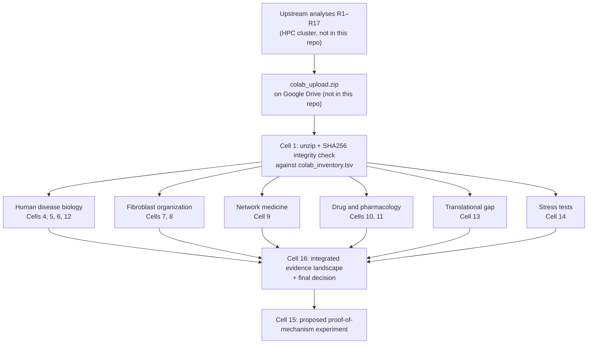

# Vildagliptin for Skin Fibrosis in Systemic Sclerosis

**A one-day hackathon drug-repurposing hypothesis.** Should vildagliptin, an approved type 2 diabetes drug that blocks the enzyme DPP-4, be tested against skin fibrosis in systemic sclerosis? This project put together public human data, network analysis and pharmacology to answer one narrow question. Does the evidence justify a lab proof-of-mechanism experiment?

> **📊 Full presentation (figures, references, business case):**
> **[Hackathon deck on Gamma](https://gamma.app/docs/Hackathon-Grupo-D-0rwwtj2kbafpj8k?mode=doc)**

> ⚠️ **Research hypothesis, not clinical evidence.** This work was produced in one day at a hackathon. It does not show that vildagliptin works in patients and is not medical advice. See the [Disclaimer](#disclaimer).

---

## Contents

- [The problem](#the-problem)
- [The hypothesis and why vildagliptin](#the-hypothesis-and-why-vildagliptin)
- [Method](#method)
- [Results](#results)
- [How to run](#how-to-run)
- [Repository structure](#repository-structure)
- [Known limitations of this repository](#known-limitations-of-this-repository)
- [Context](#context)
- [Team](#team)
- [Data and licensing](#data-and-licensing)
- [Disclaimer](#disclaimer)
- [Glossary](#glossary)

---

## The problem

Systemic sclerosis (scleroderma) is an autoimmune disease in which connective-tissue cells called **fibroblasts** become overactive. They deposit excess collagen and other matrix proteins, which makes the skin thick and stiff. Doctors grade this skin involvement with the **modified Rodnan skin score (mRSS)**. There is no curative therapy, and current treatments often have only partial effects on skin fibrosis.

## The hypothesis and why vildagliptin

**Proposal:** repurpose **vildagliptin**, a DPP-4 inhibitor approved for type 2 diabetes, for **skin fibrosis in systemic sclerosis**.

**Model being tested** (from the notebook):

```
Vildagliptin → DPP-4/CD26 inhibition → DPP4-associated progenitor/ECM fibroblast state
            → fibroblast activation and matrix remodeling → skin fibrosis in SSc
```

The team's hypothesis does **not** require DPP4 to be globally increased in diseased skin. Instead, it proposes that DPP4 marks a **specific, disease-relevant fibroblast state** that a drug could modulate.

Why vildagliptin, as stated in the notebook:

- **The target sits on the right cells.** In published single-cell work, DPP4 marks a progenitor-like fibroblast population in SSc skin (Tabib et al., _Nat Commun_ 2021, PMID [34282151](https://pubmed.ncbi.nlm.nih.gov/34282151/)).
- **Blocking the target reduced fibrosis in experiments.** Soare et al. (_Arthritis Rheumatol_ 2020, PMID [31350829](https://pubmed.ncbi.nlm.nih.gov/31350829/)) is the main mechanistic anchor. In that work, genetic or drug-based DPP4 perturbation reduced fibroblast activation and fibrosis in SSc-relevant models. The notebook also cites pulmonary-fibrosis models where vildagliptin itself showed antifibrotic activity.
- **The drug already reaches the target in people.** Published human pharmacokinetics support systemic DPP-4 inhibition at the standard dose of 50 mg twice daily.
- **The gap is translational, not biological.** In the PubMed, ClinicalTrials.gov and Cortellis records the team reviewed, it found no human interventional development of vildagliptin for SSc. This applies only to the records reviewed. It is not a claim that no such program exists.

---

## Method

**Important:** the statistical analyses were run beforehand on an HPC cluster ("DaVinci", via Slurm). **That code is not part of this repository and is no longer available.** This repository contains the **Colab notebook that loads those frozen results**, checks their integrity and turns them into the presentation figures and verdicts.



### Walkthrough

| Cell | Evidence layer          | What it shows                                                                                                            | Data (identifiers as named in the code)      |
| ---- | ----------------------- | ------------------------------------------------------------------------------------------------------------------------ | -------------------------------------------- |
| 1–2  | Setup                   | Loads the result bundle from Google Drive and verifies every file's SHA256 hash; stops if any file is missing or altered | `colab_upload.zip`                           |
| 3    | Overview                | Sankey diagram of the seven evidence layers                                                                              | —                                            |
| 4    | Human disease           | 13 pre-specified fibrosis genes (SSc vs control, FDR < 0.05) and the top Reactome pathways increased in SSc skin         | GSE58095 (bulk skin)                         |
| 5    | Cellular localization   | Fraction of DPP4-positive cells per skin cell type                                                                       | GSE138669 (single-cell)                      |
| 6    | Independent replication | SSc effect on fibroblast states and their link to DPP4 positivity                                                        | GSE249279 (single-cell)                      |
| 7    | Fibroblast organization | PAGA graph of fibroblast states, colored by SSc enrichment                                                               | GSE138669                                    |
| 8    | Regulatory state        | Inferred TGFβ/SMAD and pathway activity (PROGENy, CollecTRI) in two cohorts; DPP4+ vs DPP4− fibroblasts                  | GSE138669 + GSE249279                        |
| 9    | Network medicine        | Network proximity of DPP4 to four SSc gene modules (STRING v12, confidence ≥ 700, 1,000 degree-matched permutations)     | STRING v12                                   |
| 10   | Pharmacology            | Human exposure vs DPP4 potency; repeated-dose plasma model; skin-exposure sensitivity analysis                           | Published human PK/PD                        |
| 11   | Functional evidence     | Evidence chain from DPP4 to vildagliptin (literature curation)                                                           | PubMed                                       |
| 12   | Clinical relevance      | Fibroblast programs vs baseline mRSS                                                                                     | GSE181549                                    |
| 13   | Translational gap       | Precedent and development-gap review                                                                                     | PubMed, ClinicalTrials.gov, Cortellis review |
| 14   | Stress tests            | Does vildagliptin reverse SSc gene signatures in LINCS/L1000? Any direct human-genetic support?                          | LINCS, GWAS Catalog, GTEx, Open Targets      |
| 15   | Next step               | Design of the proposed experiment                                                                                        | —                                            |
| 16   | Decision                | Interactive evidence landscape and final decision                                                                        | —                                            |

---

### Final decision recorded in the notebook

> **Advance to a disease-relevant proof-of-mechanism experiment. This is not a clinical efficacy claim.**

### What supports the hypothesis

| Finding (as stated in the notebook)                                                                 | Numbers in this repository                                               |
| --------------------------------------------------------------------------------------------------- | ------------------------------------------------------------------------ |
| DPP4-positive fibroblasts stay linked to progenitor and ECM programs in an independent cohort       | Not traceable (see [limitations](#known-limitations-of-this-repository)) |
| DPP4 is significantly close to the fibrosis-focused gene modules, but not to the broad SSc gene set | Primary values written into the code, below                              |
| Downstream fibroblast programs track clinical skin severity (mRSS)                                  | Spearman ρ values written into the code, below                           |

**Network proximity to DPP4** (more negative z = closer than chance; values written into the code as the primary R10 result):

| Gene module             | z-score | q (FDR)                 |
| ----------------------- | ------- | ----------------------- |
| Broad SSc gene set      | −0.99   | 0.195 (not significant) |
| SSc-upregulated genes   | −1.71   | 0.039                   |
| Fibroblast-state module | −2.10   | 0.020                   |
| ECM / fibrotic module   | −4.52   | 0.002                   |

**Fibroblast programs vs baseline mRSS** (Spearman ρ, written into the code):

| Program                  | ρ     | Status in adjusted models |
| ------------------------ | ----- | ------------------------- |
| Activated (PRSS23/THBS1) | 0.70  | Supported                 |
| Myofibroblast            | 0.69  | Supported                 |
| ECM                      | 0.55  | Supported                 |
| Progenitor               | 0.44  | Directional only          |
| DPP4                     | −0.21 | Not supported             |

**Pharmacology: how much drug must reach the skin?** At 50 mg twice daily, the notebook uses a central DPP4 IC50 scenario of 4.5 nM. It reports the minimum skin-to-plasma partition ratio (Kpu) needed for local inhibition. The code stops with an error unless the result files match these values.

| Target DPP4 inhibition in skin | for ≥ 50% of the dosing interval | for ≥ 80% of the dosing interval |
| ------------------------------ | -------------------------------- | -------------------------------- |
| ≥ 80%                          | Kpu ≥ 0.10                       | Kpu ≥ 0.20                       |
| ≥ 92%                          | Kpu ≥ 0.20                       | Kpu ≥ 0.50                       |

The plasma side is anchored to published human PK. **The skin side is a sensitivity model, not measured skin data.** Actual drug levels and DPP4 inhibition in SSc skin remain **unmeasured**.

### What refines or limits the hypothesis

The notebook reports these results openly as model refinements and limitations:

- **DPP4 is not globally increased** in SSc skin, and it **is not a positive severity marker** (ρ = −0.21 with mRSS).
- **No single linear path.** The data do not support one obligatory DPP4 → myofibroblast → ECM trajectory. DPP4-high, activated and ECM-associated states share one branch of the fibroblast graph, while the myofibroblast-high state lies on a partly separate route.
- **DPP4+ fibroblasts do not have the strongest profibrotic signaling.** Compared with DPP4− fibroblasts, they show lower TGFβ, MAPK, NFκB and JAK-STAT activity and higher PI3K activity.
- **Stress tests added no support.**
  - In LINCS/L1000, neither vildagliptin nor DPP4 knockout/knockdown reproducibly reversed the three human SSc gene signatures.
  - No direct human-genetic link was found between DPP4 and SSc (no GWAS hit, locus association or relevant-tissue eQTL).
  - The notebook treats these as limits of the hypothesis, not as proof against it.

### Proposed next step (designed, not performed)

The proposed experiment uses primary dermal fibroblasts from SSc patients and healthy donors, with and without TGFβ1 stimulation. The arms are:

- vehicle
- exposure-informed vildagliptin
- DPP4 knockdown
- knockdown + vildagliptin
- nintedanib as positive control

Readouts are DPP4 enzyme activity, PRSS23/THBS1, ACTA2/TAGLN, collagen/ECM output and matrix contraction. The design separates **drug failure** (knockdown works, drug does not) from **target failure** (neither works).

---

## How to run

> The notebook **cannot be fully reproduced from this repository**. The input data bundle (`colab_upload.zip`) is not included, and the code that produced it no longer exists.

The script is a Google Colab notebook exported as Python. It depends on Colab (`google.colab.drive`, `/content` paths, a `!pip` shell command) and **will not run as a plain Python script**.

With access to the original data bundle:

1. Put `colab_upload.zip` anywhere in your Google Drive (`MyDrive`). Keep only one copy.
2. In a new Colab notebook, paste each section of `vildagliptin_ssc_figures.py` that starts with `# @title` into its own cell.
3. Run the cells in order. Cell 1 installs dependencies, mounts Drive and checks every file's SHA256 hash. If an older Plotly is already loaded, it restarts the runtime; run cell 1 again afterwards.
4. Figures are written to `/content/Figure_*.png` and `/content/Figure_16_integrated_evidence_landscape.html`.

Running cell 6 as exported raises an error; see the limitations below. To install the same libraries locally (for reading or adapting the code):

```bash
pip install -r requirements.txt
```

---

## Repository structure

```
.
├── vildagliptin_ssc_figures.py   # Colab notebook export: loads frozen results, renders 16 cells of figures/verdicts
├── requirements.txt              # Python libraries imported by the notebook
├── .gitignore                    # Excludes data, generated figures and secrets
└── README.md
```

---

## Known limitations of this repository

These are documented with `NOTE:` comments in the code and were deliberately **not** changed, so the code matches what was presented.

- **Visualization layer only.** The statistics come from an upstream pipeline that is no longer available.
- **Many verdicts are fixed text.** Every "SUPPORTED / NOT SUPPORTED" verdict is written into the code. So are the mRSS correlations (cell 12), the backup network-proximity values (cell 9) and the content of cells 11, 13, 14 and 16. Several result tables are loaded but not used.
- **Cell 6 is incomplete.** It uses two tables (`d`, `a`) that are never created in the file, because the cell that loaded them is missing from the export. Its figure cannot be regenerated.
- **Colab-only.** The file contains IPython syntax (`!pip`) and Colab-specific paths.

---

## Context

- **Event:** Cortellis Drug Repositioning Hackathon, a one-day health research hackathon on drug repurposing.
- **Date:** August 31, 2026.
- **Organizers:** Clarivate and Hospital Israelita Albert Einstein, with InovaUSP.
- **Team:** Group D.
- **Presentation:** [Gamma deck](https://gamma.app/docs/Hackathon-Grupo-D-0rwwtj2kbafpj8k?mode=doc)

## Team

This was a team project.

- **Vinicius Castelli**: one of the team's two lead developers of the computational analysis; presented the proposal and business case.
- **Other members: Celso Vitor Calomeno, Anne Torres, Luís**

---

## Data and licensing

**No data is redistributed in this repository.** The notebook loads a private bundle of pre-computed results, which is excluded by `.gitignore`.

The upstream analyses drew on these sources, each with its own terms of use:

- **Gene expression (NCBI GEO):** GSE58095, GSE138669, GSE249279, GSE181549
- **Pathways and networks:** Reactome, STRING v12, PROGENy, CollecTRI
- **Perturbation signatures:** LINCS/L1000 (SigCom LINCS)
- **Human genetics:** GWAS Catalog, GTEx, Open Targets, Ensembl
- **Literature and trials:** PubMed, ClinicalTrials.gov
- **Cortellis (Clarivate):** used only for a manual review of the development landscape during the hackathon. The code reads no Cortellis data, and no Cortellis content is included here.

"Cortellis" is a trademark of Clarivate. This project is not affiliated with or endorsed by Clarivate, Hospital Israelita Albert Einstein or InovaUSP.

---

## Disclaimer

This repository documents a **research hypothesis produced in a one-day hackathon**. It is **not clinical evidence** and does not show that vildagliptin is safe or effective for systemic sclerosis or any other condition. Several results are summarized as fixed text and could not be independently re-run. **Nothing here is medical advice.** Patients should not start, stop or change any medication on the basis of this work and should consult their physician.

---

## Glossary

| Term                  | Meaning                                                                                                                             |
| --------------------- | ----------------------------------------------------------------------------------------------------------------------------------- |
| **DPP-4 / CD26**      | An enzyme on the surface of many cells. Vildagliptin blocks it.                                                                     |
| **Fibroblast**        | Connective-tissue cell that produces collagen; overactive in SSc.                                                                   |
| **ECM**               | Extracellular matrix: the collagen-rich scaffold around cells. Too much of it causes fibrosis.                                      |
| **Myofibroblast**     | Activated, contractile fibroblast typical of scarring.                                                                              |
| **mRSS**              | Modified Rodnan skin score, the standard clinical measure of skin thickening in SSc.                                                |
| **scRNA-seq**         | Single-cell RNA sequencing: measures gene activity in individual cells.                                                             |
| **FDR / q-value**     | p-value adjusted for testing many hypotheses at once; q < 0.05 was the significance threshold.                                      |
| **Network proximity** | How close a drug target lies to disease genes in a protein-interaction network, compared with random genes of similar connectivity. |
| **Kpu**               | Ratio of drug concentration in a tissue (here skin) to that in plasma.                                                              |
| **LINCS/L1000**       | Public library of gene-expression responses of cell lines to drugs and genetic perturbations.                                       |
